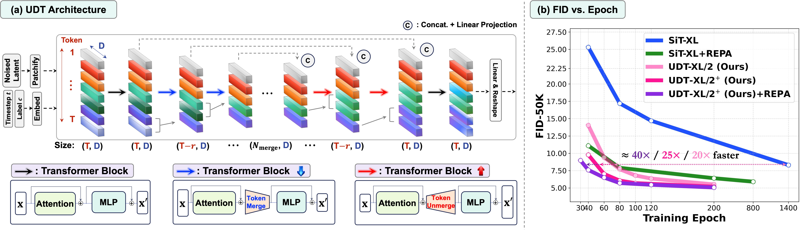

## UDT: Reconciling U-Nets and Diffusion Transformers with Data-Adaptive Token Reduction ##
<!-- [](https://arxiv.org/pdf/2509.21565) -->

We introduce **U-Net Diffusion Transformer (UDT)**, a novel architecture that combines the representation power of DiTs with the hierarchical encoding–decoding structure of U-Nets. UDT introduces data-adaptive token merging for efficient downsampling and upsampling while maintaining the original DiT token dimension.
<p align="center">
  
</p>

- UDT delivers strong generative performance, faster convergence ($\approx 40\times$ faster than SiT), and enhanced representation capability.
- UDT serves as a drop-in replacement for a wide range of DiT variants, including $\epsilon$-prediction DiTs, pixel-space DiTs (e.g., JiT), models with improved VAEs (e.g., VA-VAE), and text-to-image models (e.g., MMDiT).
- UDT achieves (on ImageNet @ $256 \times 256$):
  - UDT-XL/2 (out-of-the-box): **1.41** FID at 500 epochs
  - UDT-XL/2+ (with architectural optimization): **1.42** FID at 350 epochs
  - UDT-XL/2+ with REPA: **1.38** FID at 320 epochs
  - UDT-XL/2+ with VA-VAE: **1.35** FID at 500 epochs
- UDT-XL/2+ achieves **1.58** FID without REPA on ImageNet @ $512 \times 512$.


### 1. Create Conda Environment and Install Requirements

```bash
conda create -n UDT python=3.9 -y
conda activate UDT

cd UDT
pip install requirement.txt
```

### 2. Dataset
Please download [ImageNet](https://www.image-net.org/download.php) and follow the preprocessing protocols described in [EDM2](https://github.com/NVlabs/edm2) and [REPA](https://github.com/sihyun-yu/REPA/tree/main/preprocessing). Then, specify the path using the `--data-dir` configuration.


### 3. Training
```bash
bash scrips/Train_UDT.sh
```
You can configure the hyperparameters in `Train_UDT.sh`.
1. `--udt_mode`: Select the UDT variant:
   - `udt`: UDT without optimization improvements
   - `udt+`: UDT with optimization improvements
2. `--num_seg`: Number of tokens at the bottleneck ($N_{\text{Merge}}$ in the paper).

By setting `udt_mode` to `udt` or `udt+`, the configurations from the paper are automatically applied.  
For further customization or hyperparameter tuning, modify `train_UDT.py`.

### 4. Evaluation
```bash
bash scrips/evaluation.sh
```
For evaluation, please download the reference batches of ImageNet (256 × 256 and 512 × 512) from [ADM](https://github.com/openai/guided-diffusion/tree/main/evaluations) and place them under `./evaluator/`


### 5. Pre-trained Models

We provide pre-trained three different UDT-XL models (UDT, UDT+, and UDT+ with REPA) for ImageNet at 256 resolutions and UDT-XL (UDT+) for ImageNet at 512 resolutions. 
Pre-trained models are available at the following here [link](https://www.dropbox.com/scl/fo/9jwmy80qztwxidp8pf38c/ANYdHxSdi2flr6-OCujlcJs?rlkey=dl7llhhyr58jcrpd5s3pt4n9z&dl=0). Please download and place the pre-trained models under: `./exp/pretrain/checkpoints`

```bash
ckpt=udt+_REPA        # udt | udt+ | udt+_REPA | udt+_res512 
CFG=1.7               # 1.0 (w/o CFG)
GUIDANCE=0.7
torchrun --nnodes=1 --nproc_per_node=4 generate_UDT.py \
  --model "UDT-XL/2" \
  --num-fid-samples 50000 \
  --ckpt ./exps/pretrain/checkpoints/${ckpt}.pt \
  --resolution 256 \
  --per-proc-batch-size=64 \
  --mode=sde \
  --num-steps=250 \
  --cfg-scale=${CFG} \
  --guidance-high=${GUIDANCE} \
  --udt_mode udt+ \
  --num_seg 112 \
  --sample_dir ./samples 

# For UDT+_res512, use --resolution 512 with CFG=2.2 and GUIDANCE=0.75.
```

<!-- 
| Resolution | Model                    | Epochs | FID (w/ CFG) |
|:----------:|--------------------------|:------:|:------------:|
| 256×256    | UDT-XL/2 (out-of-the-box)| 500    | 1.41         |
|            | UDT-XL/2+ with REPA      | 320    | **1.38**     |
| 512×512    | UDT-XL/2+             | 300    | 1.76         |
|            | UDT-XL/2+ (fine-tuned)| 200    | **1.58**     | -->

## To-do List
- Release code for UDT with VA-VAE and MMUDT (UDT variant of MMDiT).


## Acknowledgements

This codebase is mainly built upon [SiT](https://github.com/willisma/SiT), [REPA](https://github.com/sihyun-yu/REPA), and [ToME-SD](https://github.com/dbolya/tomesd) repositories.

## 📝 Citation
If you use this code, please cite our paper: (TBD)

<!-- 
```bibtex
@article{yun2025LSEP,
  title = {No alignment needed for generation: Learning linearly separable representations in diffusion models},
  author = {Yun, Junno and Al{\c{c}}alar, Ya{\c{s}}ar Utku and Ak{\c{c}}akaya, Mehmet},
  journal = {arXiv preprint arXiv:2509.21565},
  year = {2025}
}

``` -->
